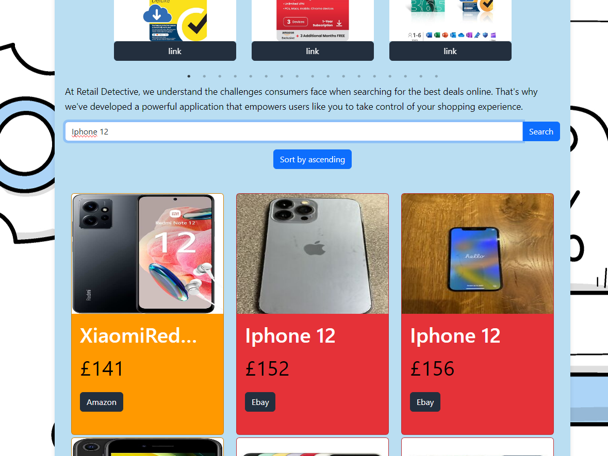

[](https://opensource.org/licenses/MIT)
# eCommerce Ranker
Link to Website: https://lovely-gingersnap-174138.netlify.app
## Description
This application is a E-Commerce ranker website that takes in a search and finds the related items for that search from various websites (Currently only Amazon and Ebay) and gives you the best prices based on those results.

## Table of Contents
[Installation](#installation) <br />
[Acceptance Criteria](#acceptance-criteria) <br />
[Usage](#usage) <br />
[Licence](#licence) <br />
[Questions](#questions)     
## Acceptance Criteria
This application will allow the user to create a search for a product of their own choosing and then get results based on their search. The results will be filtered based on the price of the item from cheapest to most expensive so that the user is able to see the best deals for that product.
- The Search bar takes in the use input
- The input is the fed to a few APIs Specifically a data scraper for Amazon, Ebay, etc.
- Take the data from the APIs and then put them into one useState
- Map the data using a card component to the page.
- Make sure the data is sorted based on price. 
- Carousel for todays best sellers.
### There are also some key requirements we as a group must meet, these are:
* Must use ReactJS.
* Must use Node.
* Must have GET route for retrieving and adding new data.
* Must deploy this application using Netlify.
* Must utilize at least two libraries, packages, or technologies that we haven't discussed.
* Must have a polished front end/UI.
* Must meet good quality coding standards (indentation, scoping, naming).
* Have a quality README (with unique name, description, technologies used, screenshot, and link to deployed application).

## Installation
In order to install the project simply click the green code button and download the file as a zip. Once downloaded simply right click on the file and unzip the folder. 
Then do a ```npm install``` on the command line.
and then run the website using ```npm run dev``` and click the local host using ```ctrl + left``` click to run the webpage locally.
* To run back server ```node server.js``` on terminal while running the server you need to run the front-end by ```npm run dev```
## Usage
### Once on the website you will be met with this page:
 
### use the search bar in the middle of the page to get best deals based on your search: 

## Licence
This work is using the lisence: MIT
## Features
- Search bar that takes in a product query 
- 3 APIs (Amazon and Ebay) that take in the searched query 
- The ranker takes in both API outputs and pushes them into array of objects and sort the objects based on the price.
- a button to change the order of cards by price, least to most, most to least. 
- a contact page.
- a Carousel that uses and API for data and uses the npm library called react-slick to import a carousel with many different types of functions, we chose to use a carousel that outputs three images items per slide.
- Contact form you fill your details and on message part if you have a lot to say you can just press button and say what you want to send, if you see some mispelling on textarea you can edit and correct it.
Used Google Cloud Speech-to-Text API.
    * Express.js
    * dotenv
    * cors